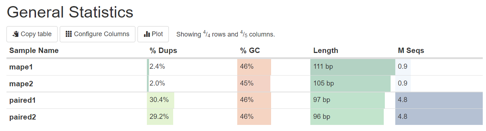
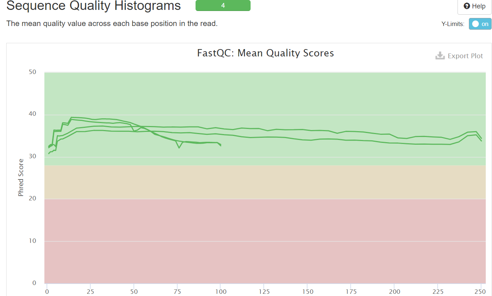
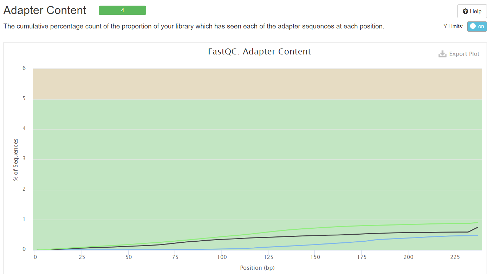
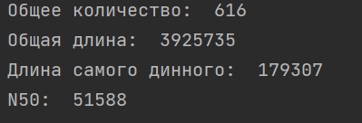
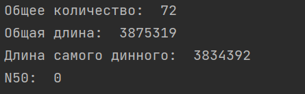

# HSE21_HW1


### Step №1  
**$** mkdir Task1  
**$** cd Task1  

### Step №2    
**$** ls /usr/share/data-minor-bioinf/assembly/* | xargs -tI{} ln -s {}  
ln -s /usr/share/data-minor-bioinf/assembly/oilMP_S4_L001_R1_001.fastq  
ln -s /usr/share/data-minor-bioinf/assembly/oilMP_S4_L001_R2_001.fastq  
ln -s /usr/share/data-minor-bioinf/assembly/oil_R1.fastq  
ln -s /usr/share/data-minor-bioinf/assembly/oil_R2.fastq  
 
### Step №3  
**$** seqtk sample -s728 oil_R1.fastq 5000000 > paired1.fastq  
**$** seqtk sample -s728 oil_R2.fastq 5000000 > paired2.fastq  
**$** seqtk sample -s728 oilMP_S4_L001_R1_001.fastq 1500000 > mape1.fastq  
**$** seqtk sample -s728 oilMP_S4_L001_R2_001.fastq 1500000 > mape2.fastq  

### Step №4  
**$** mkdir fastqc  
**$** ls *.fastq | xargs -P 4 -tI{} fastqc -o fastqc {}  

### Step №5  
**$** mkdir multiqc  
**$** multiqc -o multiqc fastqc  

### Step №6      
**$** mkdir AllFiles1  
**$** mv fastqc AllFiles1  
**$** mv multiqc AllFiles1  
**$** tar -cvzf AllFiles1.tar.gz AllFiles1  

**--- cmd**   
cd C:\Users\Ксения\Desktop\putty  
pscp -i "./privatekey.ppk" -P 5222 kasesikova@92.242.58.92:/home/kasesikova/Task1/AllFiles1.tar.gz .  

### Step №7    
**$** platanus_trim    paired1.fastq paired2.fastq    

### Step №8     
**$** mkdir trimmed_fastq  
**$** mv *.trimmed trimmed_fastq  
**$** mv *int_trimmed trimmed_fastq  

**$** mkdir trimmed_fastqc  
**$** ls trimmed_fastq/* | xargs -P 4 -tI{} fastqc -o trimmed_fastqc {}  

**$** mkdir trimmed_multiqc  
**$** multiqc -o trimmed_multiqc trimmed_fastqc    

### Step №9  
**$** mv trimmed_multiqc AllFiles2  
**$** tar -cvzf AllFiles2.tar.gz AllFiles2  

**--- cmd**   
cd C:\Users\Ксения\Desktop\putty    
pscp -i "./privatekey.ppk" -P 5222 kasesikova@92.242.58.92:/home/kasesikova/Task1/AllFiles2.tar.gz .  

### Step №10  
**$** time platanus assemble -f trimmed_fastq/paired1.fastq.trimmed trimmed_fastq/paired2.fastq.trimmed  
**$** time platanus scaffold -c out_contig.fa -IP1 trimmed_fastq/paired1.fastq.trimmed trimmed_fastq/paired2.fastq.trimmed -OP2 trimmed_fastq/mape1.fastq.int_trimmed trimmed_fastq/mape2.fastq.int_trimmed  
**$** time platanus gap_close -c out_scaffold.fa -IP1 trimmed_fastq/paired1.fastq.trimmed trimmed_fastq/paired2.fastq.trimmed -OP2 trimmed_fastq/mape1.fastq.int_trimmed trimmed_fastq/mape2.fastq.int_trimmed  

**--- cmd**
**$** pscp -i "./privatekey.ppk" -P 5222 kasesikova@92.242.58.92:/home/kasesikova/Task1/out_contig.fa .  
**$** pscp -i "./privatekey.ppk" -P 5222 kasesikova@92.242.58.92:/home/kasesikova/Task1/out_scaffold.fa .  
**$** pscp -i "./privatekey.ppk" -P 5222 kasesikova@92.242.58.92:/home/kasesikova/Task1/out_gapClosed.fa .  


# ОТЧЁТ №1


# ОТЧЁТ №2








# КОД №1
```python
count = 0  
length = 0  
array = []  
for line in open("out_scaffold.fa"):  
    if(line[0] == '>'):  
        count+=1  
        data = int(line.split('_')[1][3:])  
        length += data  
        array.append(data)  

 **print("Общее количество: ", count)  
print("Общая длина: ",  length)  
print("Длина самого динного: ", max(array))**   

summa = 0  
N50 =0  
array.sort(reverse=True)  
for num in array:  
    summa += num  
    if (summa <= length/2):  
        N50 = num  

**print("N50: ", N50)**  
```
### Результат out_contig.fa



### Результат out_scaffold.fa.fa



# КОД №2

```python
data = 0
array = []
check = 0
for line in open("out_scaffold.fa"):
    if(line[0] != '>'):
        data += len(line.strip())
    else:
        if (check != 0):
            array.append(data)
        data = 0
        check = 1
array.append(data)

maxim = -100
position = 0
for num in array:
    if maxim < num:
        maxim = num
        position_max = position
    position+=1

print("Номер самого длинного: ", position_max)

c = -1
text = ""
for line in open("out_scaffold.fa"):
    if (line[0] == '>'):
        c+=1
    elif (c == position_max):
        text += line.strip()

lenN = 0
countgap = 0
bool = False
for letter in text:
    if(letter == 'N'):
        lenN +=1
        if (bool == False):
            countgap += 1
        bool = True
    else:
        bool = False

print("Количетво гэпов: ", countgap)
print("Общая длина: ", lenN)


```


