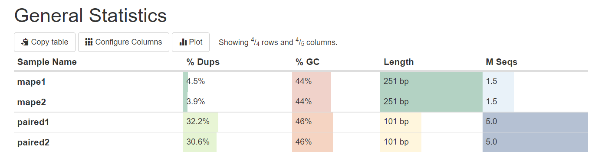
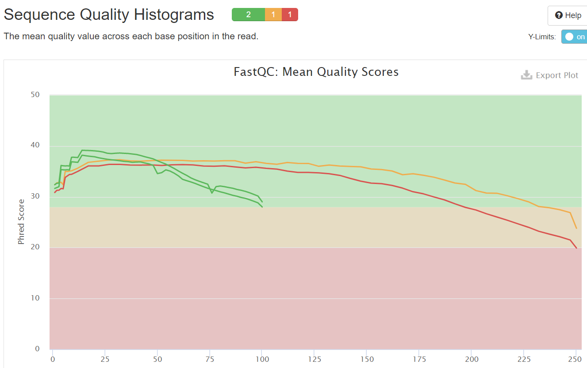
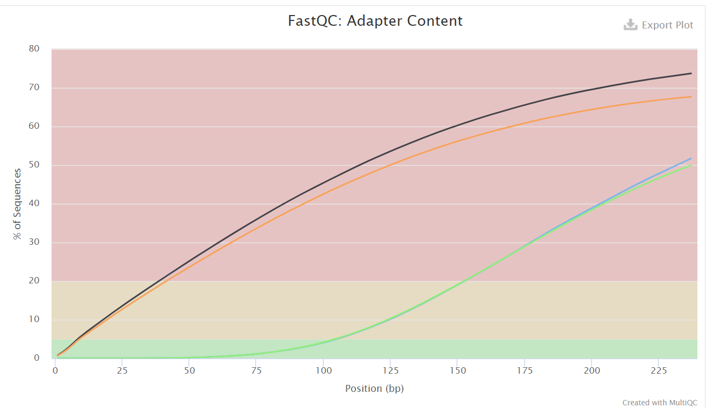

# HSE21_HW1

**Step №1**  
**$** mkdir Task1  
**$** cd Task1  

**Step №2**  
**$** ls /usr/share/data-minor-bioinf/assembly/* | xargs -tI{} ln -s {}  
ln -s /usr/share/data-minor-bioinf/assembly/oilMP_S4_L001_R1_001.fastq  
ln -s /usr/share/data-minor-bioinf/assembly/oilMP_S4_L001_R2_001.fastq  
ln -s /usr/share/data-minor-bioinf/assembly/oil_R1.fastq  
ln -s /usr/share/data-minor-bioinf/assembly/oil_R2.fastq  
 

**Step №3**  
**$** seqtk sample -s728 oil_R1.fastq 5000000 > paired1.fastq  
**$** seqtk sample -s728 oil_R2.fastq 5000000 > paired2.fastq  
**$** seqtk sample -s728 oilMP_S4_L001_R1_001.fastq 1500000 > mape1.fastq  
**$** seqtk sample -s728 oilMP_S4_L001_R2_001.fastq 1500000 > mape2.fastq  

**Step №4**  
**$** mkdir fastqc  
**$** ls *.fastq | xargs -P 4 -tI{} fastqc -o fastqc {}  

**Step №5**  
**$** mkdir multiqc  
**$** multiqc -o multiqc fastqc  

**Step №6**  
**$** mkdir AllFiles1  
**$** mv fastqc AllFiles1  
**$** mv multiqc AllFiles1  
**$** tar -cvzf AllFiles1.tar.gz AllFiles1  

**--- cmd**   
cd C:\Users\Ксения\Desktop\putty  
pscp -i "./privatekey.ppk" -P 5222 kasesikova@92.242.58.92:/home/kasesikova/Task1/AllFiles1.tar.gz .  

**Step №7**  
**$** platanus_trim    paired1.fastq paired2.fastq    

**Step №8**   
**$** mkdir trimmed_fastq  
**$** mv *.trimmed trimmed_fastq  
**$** mv *int_trimmed trimmed_fastq  

**$** mkdir trimmed_fastqc  
**$** ls trimmed_fastq/* | xargs -P 4 -tI{} fastqc -o trimmed_fastqc {}  

**$** mkdir trimmed_multiqc  
**$** multiqc -o trimmed_multiqc trimmed_fastqc    

**Step №9**  
**$** mv trimmed_multiqc AllFiles2  
**$** tar -cvzf AllFiles2.tar.gz AllFiles2  

**--- cmd**   
cd C:\Users\Ксения\Desktop\putty    
pscp -i "./privatekey.ppk" -P 5222 kasesikova@92.242.58.92:/home/kasesikova/Task1/AllFiles2.tar.gz .  

**Step №10**  
**$** time platanus assemble -f trimmed_fastq/paired1.fastq.trimmed trimmed_fastq/paired2.fastq.trimmed  
**$** time platanus scaffold -c out_contig.fa -IP1 trimmed_fastq/paired1.fastq.trimmed trimmed_fastq/paired2.fastq.trimmed -OP2 trimmed_fastq/mape1.fastq.int_trimmed trimmed_fastq/mape2.fastq.int_trimmed  
**$** time platanus gap_close -c out_scaffold.fa -IP1 trimmed_fastq/paired1.fastq.trimmed trimmed_fastq/paired2.fastq.trimmed -OP2 trimmed_fastq/mape1.fastq.int_trimmed trimmed_fastq/mape2.fastq.int_trimmed  

**--- cmd**
**$** pscp -i "./privatekey.ppk" -P 5222 kasesikova@92.242.58.92:/home/kasesikova/Task1/out_contig.fa .  
**$** pscp -i "./privatekey.ppk" -P 5222 kasesikova@92.242.58.92:/home/kasesikova/Task1/out_scaffold.fa .  
**$** pscp -i "./privatekey.ppk" -P 5222 kasesikova@92.242.58.92:/home/kasesikova/Task1/out_gapClosed.fa .  

# ОТЧЁТ№1

# ОТЧЁТ№2

